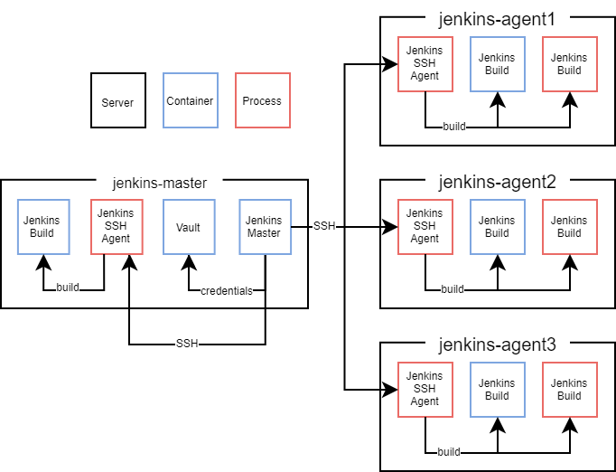

# General

As the [official documentation](https://wiki.jenkins.io/display/jenkins/distributed+builds) suggests, this project also uses a master-agent infrastructure.     

## In general

*jenkins-master* is responsible for co-ordination, most of the configuration and the GUI. 
Unfortunately jenkins runs all builds with its own linux user (in this project *jenkins*), so an evil developer can create a pipeline that simply reads all content from jenkins docker container, including all credentials. As using a different linux user would prevent this, the documentation suggests to run all builds on *nodes* (different servers like *jenkins-agent1*). Now there is no way for a pipeline to access secret information from the *jenkins-master*.

## Reuse the master node for builds?

Jenkins uses ssh to connect to jenkins-master as the linux user *agent*. To prevent the * agent* user from reading the jenkins docker container, the [rootless version of docker](https://docs.docker.com/engine/security/rootless/) is installed for all users who want to use docker. This way both users (*jenkins* and *agent*) have their own docker context and no root rights anymore.

## Traefik

[Traefik](https://doc.traefik.io/traefik/) is a simple to use reverse proxy for http, tcp and udp traffic with built-in support for Let's Encrypt.

## Vault

[Hashicorp](https://www.vaultproject.io/) vault is a production ready store to manage secrets and protect sensitive data.

Vault is a product specifically designed for storing credentials while jenkins in first place is an automation server. It's recommended to use vault instead of jenkins built-in credentials store.

It also simplifies to process of adding new credentials to builds. This would be the "old" process:

  * create credentials on local jenkins
  * jenkins encrypts them with it's own encryption key
  * push new pipeline to git repository
  * encrypt credentials on prod jenkins with prod encryption key
  * add encrypted credentials to teams seed folder

With vault both stages use the same credentials, so you can go with:

  * create credentials in vault
  * push new pipeline to git repository